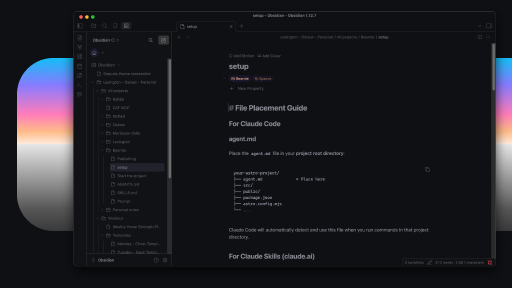
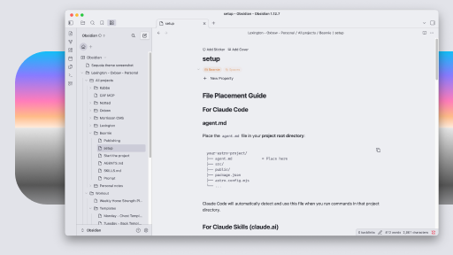

# Sequoia for Obsidian

Elegant, minimal, and clean color palette for your tools.

See other interfaces at the [official website](https://www.michaelandreuzza.com/vscode/sequoia/).

## Preview

| Sequoia Moonlight Dark | Sequoia Moonlight Light |
| --- | --- |
|  |  |

## Available themes

- **Moonlight Dark** — dark
- **Moonlight Light** — light
- **Monochrome Dark** — dark
- **Monochrome Light** — light
- **Retro Dark** — dark
- **Retro Light** — light

## Installation

### Community theme (recommended)

Install **Sequoia** from Obsidian **Settings → Appearance → Manage → Community themes**, or browse from [community.obsidian.md](https://community.obsidian.md).

The community theme ships **Sequoia Moonlight Light** (light mode) and **Sequoia Moonlight Dark** (dark mode) in `theme.css`.

### Extra variants (CSS snippets)

Copy files from `variants/` into `.obsidian/snippets/` and enable in **Appearance → CSS snippets**. Only enable one dark snippet at a time.

Available: `variants/sequoia-monochrome-dark.css`, `variants/sequoia-monochrome-light.css`, `variants/sequoia-retro-dark.css`, `variants/sequoia-retro-light.css`.

### CSS snippets (single variant)

Copy a CSS file into `.obsidian/snippets/` and enable in **Appearance → CSS snippets**.

Available files: `sequoia-moonlight-dark.css`, `sequoia-moonlight-light.css`, `sequoia-monochrome-dark.css`, `sequoia-monochrome-light.css`, `sequoia-retro-dark.css`, `sequoia-retro-light.css`.

See `COMMUNITY.md` for publishing and release steps.

## Created by

By [Micheal Andreuzza](https://michaelandreuzza.com/) at [Lexington Themes](https://lexingtonthemes.com/)
